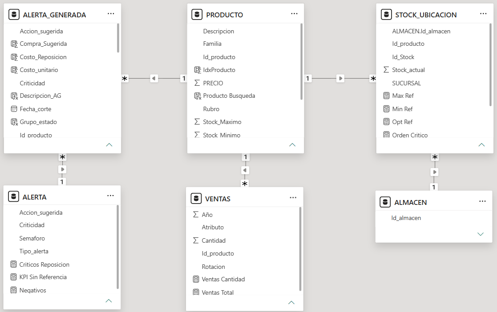
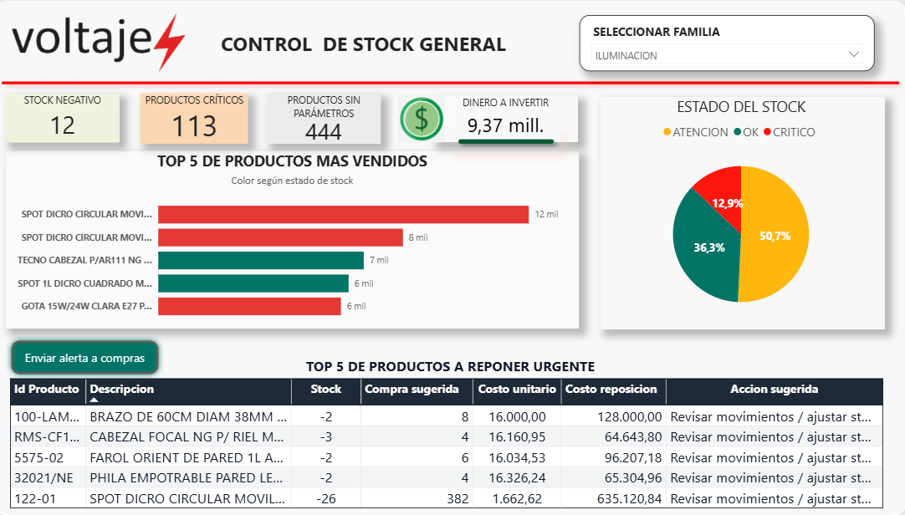
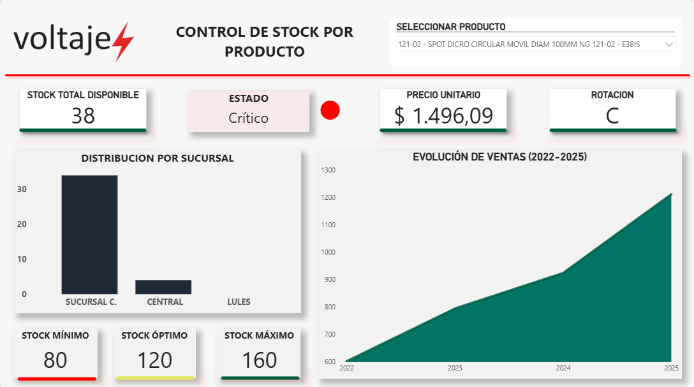

# ⚡ Control y Reabastecimiento Inteligente de Stock | Voltaje SRL

Proyecto de **Business Intelligence** desarrollado a partir de una necesidad real de negocio en Voltaje SRL, con el objetivo de mejorar la visibilidad del inventario y facilitar la toma de decisiones de reposición.

## 🎯 Problema de negocio

Durante el relevamiento del proceso de stock se identificaron distintas dificultades que afectaban el trabajo diario de las áreas de **Compras y Depósito**.

La información disponible no siempre permitía conocer de forma rápida y consolidada cuánto stock existía de cada producto y cómo se encontraba distribuido entre las distintas ubicaciones. Además, parte del control de faltantes y prioridades se realizaba manualmente, dificultando la detección temprana de productos críticos y la priorización de reposiciones.

También se identificó la necesidad de contar con indicadores que permitieran evaluar el estado general del inventario y convertir los datos disponibles en información útil para la toma de decisiones.

## 💡 Objetivo

Desarrollar una solución que permitiera **centralizar, analizar y visualizar la información de stock**, detectar situaciones que requirieran atención y brindar criterios claros para decidir cuándo reponer, revisar o redistribuir productos.

## 🚀 Solución desarrollada

Se construyó un módulo de control y reabastecimiento capaz de:

- Consolidar el stock de cada producto entre las distintas ubicaciones.
- Clasificar automáticamente el estado del inventario.
- Detectar productos críticos, stock negativo y productos sin parámetros definidos.
- Identificar situaciones de sobrestock.
- Calcular cantidades sugeridas de reposición.
- Estimar el costo necesario para reponer productos críticos.
- Priorizar artículos que requieren atención.
- Analizar la información mediante dashboards e indicadores.
- Generar un reporte de alertas para el área de Compras.

## 🛠️ Tecnologías utilizadas

**Power BI · Power Query · DAX · n8n**

## ⚙️ Proceso de trabajo

El desarrollo comenzó con el **relevamiento del proceso y de las necesidades de los usuarios**. A partir de allí se trabajó sobre los datos disponibles, su preparación, modelado y transformación en información útil para la gestión.

**Relevamiento → Preparación de datos → Modelado → Reglas de negocio → KPIs → Dashboards → Automatización**

Los datos fueron preparados y normalizados mediante **Power Query**, realizando tareas de limpieza, estandarización y validación.

Posteriormente se construyó el modelo de datos y se utilizaron medidas y cálculos en **DAX** para implementar las reglas de control, calcular indicadores y generar sugerencias de reposición.

## 🗂️ Modelo de datos

El modelo integra información de **productos, stock por ubicación, almacenes, ventas y alertas**, permitiendo consolidar el stock disponible y aplicar las reglas necesarias para evaluar el estado de cada artículo.

## 📊 Dashboards desarrollados

### Control de Stock General

Dashboard orientado a obtener una visión global del inventario y detectar rápidamente situaciones que requieren atención.

Permite analizar:

- Productos críticos.
- Productos sin parámetros.
- Productos con stock negativo.
- Estado general del stock.
- Dinero estimado necesario para reposición.
- Productos más vendidos.
- Productos con mayor urgencia de reposición.

### Control de Stock por Producto

Dashboard diseñado para profundizar el análisis de un artículo específico.

Permite consultar:

- Stock total disponible.
- Estado actual del producto.
- Distribución del stock entre sucursales o depósitos.
- Parámetros de stock mínimo, óptimo y máximo.
- Precio unitario.
- Evolución histórica de ventas.

## 🚨 Automatización de alertas

Para complementar el análisis realizado en Power BI, se implementó un flujo automatizado con **n8n**.

Desde el dashboard, el usuario puede ejecutar el envío de una alerta al área de Compras. El flujo procesa la información disponible, identifica los productos críticos y genera un correo con los artículos que requieren atención.

De esta manera, el proyecto busca conectar el análisis con la acción: **no solo mostrar qué está ocurriendo con el inventario, sino facilitar que esa información pueda utilizarse para tomar una decisión.**

## 🌱 Aprendizajes

Este proyecto me permitió aplicar herramientas de análisis de datos dentro de un contexto real de negocio y comprender la importancia de trabajar primero sobre la necesidad antes de pensar en la tecnología.

Además de fortalecer mis conocimientos en **Power BI, Power Query y DAX**, pude trabajar en relevamiento de requisitos, calidad y modelado de datos, definición de reglas de negocio, construcción de KPIs y automatización de procesos.

Uno de los principales aprendizajes fue entender que el valor del análisis no está solamente en visualizar datos, sino en **transformarlos en información clara y accionable para quienes necesitan tomar decisiones**.

---

📌 *Los datos utilizados corresponden al contexto en el que se desarrolló el proyecto y no representan la situación operativa actual de la empresa.*
